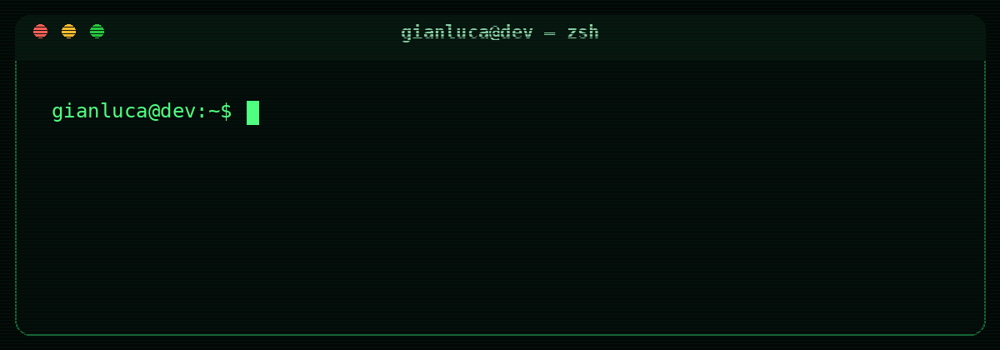

<div align="center">



<br>

<a href="https://www.linkedin.com/in/gianluca-jon%C3%A1s-giardino-sancho-497979274/">
  
</a>
<a href="mailto:gravitty99@gmail.com">
  
</a>

<br><br>

<a href="#english">English</a> · <a href="#español">Español</a>

</div>

---

<a id="english"></a>

## `> English`

```ts
const gianluca = {
  role: "Full-Stack Developer",
  location: "Argentina",
  builds: ["web", "mobile", "APIs", "AI products", "automation"],
  approach: "from idea to production"
};
```

I build **complete digital products**, working across product definition, UX/UI, frontend, backend, databases, APIs, integrations, automation, deployment and infrastructure.

My experience includes business platforms, inventory and management systems, ecommerce, mobile applications, private chats, AI-powered products, RAG control tools, security-oriented applications and custom prototypes.

### `./capabilities`

<table>
<tr>
<td width="50%" valign="top">

**Product & interface**

- Full-stack web applications
- React Native mobile applications
- Responsive UX/UI
- Fluid interface animations
- SaaS, MVPs and internal tools

</td>
<td width="50%" valign="top">

**Backend & data**

- Node.js and Python services
- REST APIs and integrations
- Authentication and permissions
- SQL and NoSQL architecture
- Realtime systems

</td>
</tr>
<tr>
<td width="50%" valign="top">

**AI & automation**

- LLM-powered applications
- Conversational interfaces
- RAG systems and dashboards
- Code-based automation
- n8n workflows

</td>
<td width="50%" valign="top">

**Infrastructure**

- Docker environments
- Linux and VPS configuration
- Domains and DNS
- Cloud deployments
- Production environment setup

</td>
</tr>
</table>

### `./stack`

<p>

</p>

```text
Frontend       React · React Native · Next.js · Vite · TypeScript
Backend        Node.js · Express · Python · REST APIs
Data           MySQL · PostgreSQL · MongoDB · Firebase · Supabase
Infrastructure Docker · Linux · VPS · Vercel · GitHub
Automation     Native workflows · n8n · API integrations
AI             LLM integrations · conversational apps · RAG systems
```

### `./workflow`

```text
idea → product definition → UX/UI → architecture
     → frontend + backend → integrations → deployment → iteration
```

### `./education`

**Diploma in Web Development**  
Ícaro, in collaboration with the National University of Córdoba · **2023**

I continue expanding my experience through real-world products, freelance work, independent research and continuous development.

<div align="right"><a href="#top">↑ back to top</a></div>

---

<a id="español"></a>

## `> Español`

```ts
const gianluca = {
  rol: "Desarrollador Full-Stack",
  ubicación: "Argentina",
  construye: ["web", "mobile", "APIs", "productos con IA", "automatización"],
  enfoque: "desde la idea hasta producción"
};
```

Construyo **productos digitales completos**, trabajando en definición de producto, UX/UI, frontend, backend, bases de datos, APIs, integraciones, automatización, despliegue e infraestructura.

Mi experiencia incluye plataformas empresariales, sistemas de gestión e inventario, ecommerce, aplicaciones móviles, chats privados, productos con IA, herramientas de control para sistemas RAG, aplicaciones orientadas a seguridad y prototipos personalizados.

### `./capacidades`

<table>
<tr>
<td width="50%" valign="top">

**Producto e interfaz**

- Aplicaciones web Full-Stack
- Aplicaciones móviles con React Native
- UX/UI responsiva
- Animaciones fluidas
- SaaS, MVPs y herramientas internas

</td>
<td width="50%" valign="top">

**Backend y datos**

- Servicios con Node.js y Python
- APIs REST e integraciones
- Autenticación y permisos
- Arquitectura SQL y NoSQL
- Sistemas en tiempo real

</td>
</tr>
<tr>
<td width="50%" valign="top">

**IA y automatización**

- Aplicaciones potenciadas con LLMs
- Interfaces conversacionales
- Sistemas y dashboards RAG
- Automatización mediante código
- Flujos con n8n

</td>
<td width="50%" valign="top">

**Infraestructura**

- Entornos con Docker
- Linux y configuración de VPS
- Dominios y DNS
- Despliegues cloud
- Configuración de producción

</td>
</tr>
</table>

### `./stack`

<p>

</p>

```text
Frontend       React · React Native · Next.js · Vite · TypeScript
Backend        Node.js · Express · Python · APIs REST
Datos          MySQL · PostgreSQL · MongoDB · Firebase · Supabase
Infraestructura Docker · Linux · VPS · Vercel · GitHub
Automatización Flujos nativos · n8n · integraciones con APIs
IA             Integración de LLMs · apps conversacionales · sistemas RAG
```

### `./proceso`

```text
idea → definición de producto → UX/UI → arquitectura
     → frontend + backend → integraciones → despliegue → iteración
```

### `./formación`

**Diplomatura en Desarrollo Web**  
Ícaro, en convenio con la Universidad Nacional de Córdoba · **2023**

Continúo ampliando mi experiencia mediante productos reales, trabajos freelance, investigación independiente y desarrollo constante.

<div align="right"><a href="#top">↑ volver arriba</a></div>

---

<div align="center">


<br><br>

<sub>Available for custom products, AI integrations and full-stack development.</sub>

</div>

