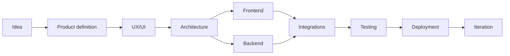
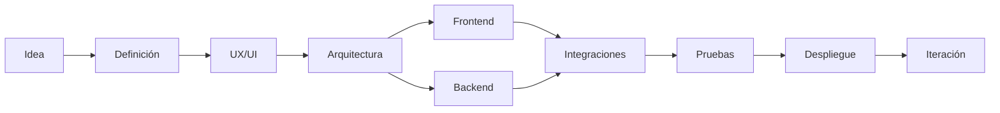

<div align="center">


<br />


<br />

```text
Frontend  ·  Backend  ·  Mobile  ·  AI  ·  Automation  ·  Infrastructure
```

<br />

<a href="https://www.linkedin.com/in/gianluca-jon%C3%A1s-giardino-sancho-497979274/">
  
</a>
<a href="mailto:gravitty99@gmail.com">
  
</a>
<a href="https://github.com/Luzbel33?tab=repositories">
  
</a>

<br />
<br />

<a href="#-english">English</a>
 ·  <a href="#-español">Español</a>

</div>

---

# 🇺🇸 English

## `> whoami`

```ts
const gianluca = {
  role: "Full-Stack Developer",
  location: "Argentina",
  focus: [
    "Complete digital products",
    "AI-powered applications",
    "Business automation",
    "Modern user experiences"
  ],
  approach: "Idea → Architecture → Design → Development → Deployment"
};
```

I'm a **Full-Stack Developer** focused on transforming ideas and business requirements into complete, functional and production-ready digital products.

I work across the entire development lifecycle: product definition, UX/UI, frontend, backend, mobile development, databases, APIs, integrations, automation, deployment and infrastructure.

Rather than working only on isolated features, I enjoy understanding the complete problem and building connected systems that balance user experience, performance, maintainability, security and business objectives.

---

## `> areas_of_expertise`

<table>
<tr>
<td width="50%" valign="top">

### ⚡ Product development

* Full-stack web applications
* React Native mobile applications
* Custom SaaS platforms
* Management and inventory systems
* Ecommerce and digital catalogs
* MVPs and interactive prototypes

</td>
<td width="50%" valign="top">

### 🤖 AI and automation

* AI-powered applications
* Conversational interfaces
* LLM integrations
* RAG systems and dashboards
* Native code automation
* n8n workflows and integrations

</td>
</tr>

<tr>
<td width="50%" valign="top">

### 🧩 Backend and data

* REST API design
* Authentication and permissions
* SQL and NoSQL architecture
* Realtime data
* External service integrations
* Server-side business logic

</td>
<td width="50%" valign="top">

### 🚀 Infrastructure

* Docker environments
* VPS configuration
* Domains and DNS
* Production deployments
* Linux environments
* Cloud platforms and services

</td>
</tr>
</table>

---

## `> tech_stack`

### Languages

<p>
  
</p>

### Frontend and mobile

<p>
  
</p>

```text
React · React Native · Next.js · Vite · Responsive UI · Animations · UX/UI
```

### Backend

<p>
  
</p>

```text
Node.js · Express · Python · REST APIs · Authentication · Integrations
```

### Databases and services

<p>
  
</p>

```text
MySQL · PostgreSQL · MongoDB · Firebase · Supabase · SQL · NoSQL
```

### Infrastructure and tools

<p>
  
</p>

```text
Docker · Linux · VPS · Vercel · Git · GitHub · DNS · Deployments · n8n
```

---

## `> what_i_build`

```text
┌──────────────────────────────┐
│ Business software            │
│ Management systems           │
│ Stock and inventory apps     │
├──────────────────────────────┤
│ Dynamic web platforms        │
│ Ecommerce and catalogs       │
│ Mobile applications          │
├──────────────────────────────┤
│ AI assistants                │
│ Conversational products      │
│ RAG dashboards and tools     │
├──────────────────────────────┤
│ APIs and integrations        │
│ Automation workflows         │
│ Product prototypes and MVPs  │
└──────────────────────────────┘
```

My projects have included business management tools, stock systems, ecommerce platforms, mobile apps, private chats, AI-powered applications, RAG management interfaces, security-oriented applications, games and experimental product concepts.

---

## `> development_process`



I can contribute to a specific part of a project or take responsibility for the complete process, from the original idea to a deployed and functional product.

---

## `> education`

```text
Diploma in Web Development
Ícaro · In collaboration with Universidad Nacional de Córdoba
Completed in 2023
```

Since then, I have continued developing my skills through real-world products, freelance work, independent research and continuous hands-on development.

---

## `> currently_interested_in`

```yaml
interests:
  - AI-powered products
  - RAG and knowledge systems
  - Custom SaaS platforms
  - Process automation
  - Product architecture
  - Modern web and mobile experiences
```

---

<div align="right">

[↑ Back to top](#)

</div>

---

# 🇦🇷 Español

## `> quién_soy`

```ts
const gianluca = {
  rol: "Desarrollador Full-Stack",
  ubicación: "Argentina",
  enfoque: [
    "Productos digitales completos",
    "Aplicaciones con inteligencia artificial",
    "Automatización de procesos",
    "Experiencias de usuario modernas"
  ],
  proceso: "Idea → Arquitectura → Diseño → Desarrollo → Despliegue"
};
```

Soy **desarrollador Full-Stack**, enfocado en transformar ideas y necesidades de negocio en productos digitales completos, funcionales y preparados para producción.

Trabajo en todo el ciclo de desarrollo: definición de producto, UX/UI, frontend, backend, desarrollo mobile, bases de datos, APIs, integraciones, automatización, despliegue e infraestructura.

No me limito a desarrollar funcionalidades aisladas. Me interesa comprender el problema completo y construir sistemas conectados, equilibrando experiencia de usuario, rendimiento, mantenibilidad, seguridad y objetivos de negocio.

---

## `> áreas_de_experiencia`

<table>
<tr>
<td width="50%" valign="top">

### ⚡ Desarrollo de productos

* Aplicaciones web Full-Stack
* Aplicaciones móviles con React Native
* Plataformas SaaS personalizadas
* Sistemas de gestión e inventario
* Ecommerce y catálogos digitales
* MVPs y prototipos interactivos

</td>
<td width="50%" valign="top">

### 🤖 IA y automatización

* Aplicaciones potenciadas con IA
* Interfaces conversacionales
* Integraciones con LLMs
* Sistemas y dashboards RAG
* Automatizaciones mediante código
* Flujos e integraciones con n8n

</td>
</tr>

<tr>
<td width="50%" valign="top">

### 🧩 Backend y datos

* Diseño de APIs REST
* Autenticación y permisos
* Arquitectura SQL y NoSQL
* Datos en tiempo real
* Integraciones con servicios externos
* Lógica de negocio del servidor

</td>
<td width="50%" valign="top">

### 🚀 Infraestructura

* Entornos con Docker
* Configuración de VPS
* Dominios y DNS
* Despliegues a producción
* Entornos Linux
* Plataformas y servicios cloud

</td>
</tr>
</table>

---

## `> stack_tecnológico`

### Lenguajes

<p>
  
</p>

### Frontend y mobile

<p>
  
</p>

```text
React · React Native · Next.js · Vite · Interfaces responsivas · Animaciones
```

### Backend

<p>
  
</p>

```text
Node.js · Express · Python · APIs REST · Autenticación · Integraciones
```

### Bases de datos y servicios

<p>
  
</p>

```text
MySQL · PostgreSQL · MongoDB · Firebase · Supabase · SQL · NoSQL
```

### Infraestructura y herramientas

<p>
  
</p>

```text
Docker · Linux · VPS · Vercel · Git · GitHub · DNS · Despliegues · n8n
```

---

## `> qué_construyo`

```text
┌──────────────────────────────┐
│ Software empresarial         │
│ Sistemas de gestión          │
│ Aplicaciones de inventario   │
├──────────────────────────────┤
│ Plataformas web dinámicas    │
│ Ecommerce y catálogos        │
│ Aplicaciones móviles         │
├──────────────────────────────┤
│ Asistentes con IA            │
│ Productos conversacionales   │
│ Herramientas y sistemas RAG  │
├──────────────────────────────┤
│ APIs e integraciones         │
│ Flujos automatizados         │
│ Prototipos y productos MVP   │
└──────────────────────────────┘
```

Mis proyectos incluyen herramientas de gestión empresarial, sistemas de stock, plataformas ecommerce, aplicaciones móviles, chats privados, aplicaciones con IA, interfaces para administrar sistemas RAG, aplicaciones orientadas a seguridad, juegos y conceptos experimentales.

---

## `> proceso_de_desarrollo`



Puedo participar en un área específica del proyecto o encargarme del proceso completo, desde la idea original hasta un producto desplegado y funcional.

---

## `> formación`

```text
Diplomatura en Desarrollo Web
Ícaro · En convenio con la Universidad Nacional de Córdoba
Finalizada en 2023
```

Desde entonces continúo ampliando mi experiencia mediante productos reales, trabajos freelance, investigación independiente y desarrollo constante.

---

## `> intereses_actuales`

```yaml
intereses:
  - Productos potenciados con IA
  - Sistemas RAG y bases de conocimiento
  - Plataformas SaaS personalizadas
  - Automatización de procesos
  - Arquitectura de productos
  - Experiencias web y mobile modernas
```

---

<div align="right">

[↑ Volver arriba](#)

</div>

---

## `> github_stats`

<div align="center">

<picture>
  <source
    srcset="https://github-readme-stats.vercel.app/api?username=Luzbel33&show_icons=true&hide_border=true&bg_color=00000000&title_color=a855f7&text_color=c9d1d9&icon_color=7c3aed"
    media="(prefers-color-scheme: dark)"
  />
  <source
    srcset="https://github-readme-stats.vercel.app/api?username=Luzbel33&show_icons=true&hide_border=true&title_color=7c3aed&icon_color=7c3aed"
    media="(prefers-color-scheme: light)"
  />
  
</picture>

<picture>
  <source
    srcset="https://github-readme-stats.vercel.app/api/top-langs/?username=Luzbel33&layout=compact&hide_border=true&bg_color=00000000&title_color=a855f7&text_color=c9d1d9"
    media="(prefers-color-scheme: dark)"
  />
  <source
    srcset="https://github-readme-stats.vercel.app/api/top-langs/?username=Luzbel33&layout=compact&hide_border=true&title_color=7c3aed"
    media="(prefers-color-scheme: light)"
  />
  
</picture>

<br />
<br />


<br />
<br />


</div>

---

<div align="center">

```text
┌─ gianluca@dev
│
├─ Building products
├─ Solving real problems
├─ Learning continuously
└─ Turning ideas into software
```

<br />

**Open to building ambitious digital products and custom technology solutions.**

<br />

<a href="mailto:gravitty99@gmail.com">
  
</a>

<br />
<br />


</div>
