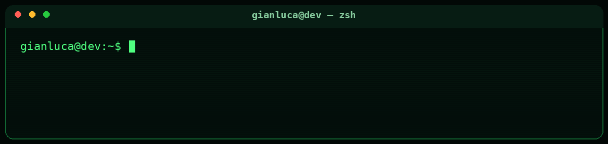
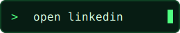
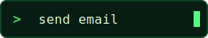
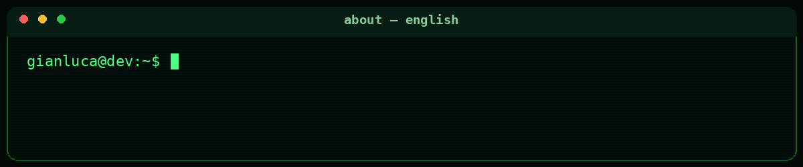
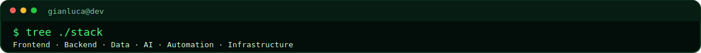
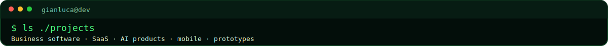
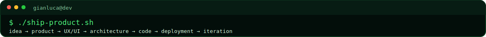
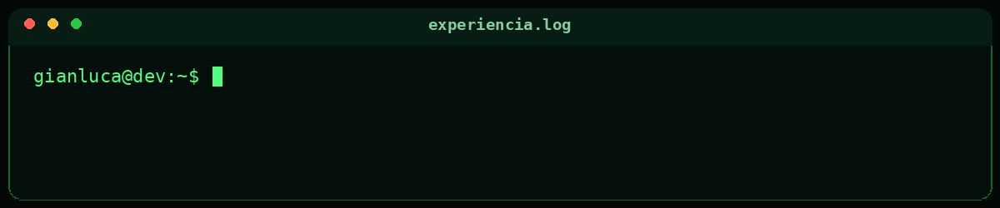
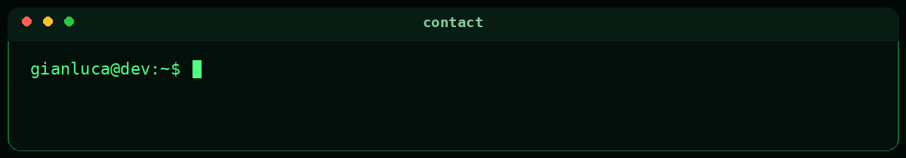

<a id="top"></a>

<div align="center">



<br><br>

<a href="https://www.linkedin.com/in/gianluca-jon%C3%A1s-giardino-sancho-497979274/">
  
</a>
&nbsp;&nbsp;
<a href="mailto:gravitty99@gmail.com">
  
</a>

<br><br>

<a href="#english">English</a> · <a href="#español">Español</a>

</div>

---

<a id="english"></a>



I’m a **Full-Stack Developer** from Argentina. I like taking an idea, understanding the real problem behind it and turning it into a product that is useful, polished and ready to run.

Since **March 2026**, I’ve been working as a **Lead Developer at a fintech company**, where I combine hands-on development with technical decisions, product thinking and coordination.

Over the last few years I’ve built management systems, inventory apps, ecommerce platforms, mobile products, private chats, AI-powered tools, RAG control panels, security-oriented applications, games and experimental prototypes.

<br>



### `frontend/`

<p>
  
</p>

`React` · `React Native` · `Next.js` · `Vite` · `JavaScript` · `TypeScript` · responsive UI · fluid animations

### `backend/`

<p>
  
</p>

`Node.js` · `Express` · `Python` · REST APIs · authentication · permissions · integrations

### `data/`

<p>
  
</p>

`MySQL` · `PostgreSQL` · `MongoDB` · `Firebase` · `Supabase` · SQL · NoSQL · realtime data

### `infrastructure/`

<p>
  
</p>

`Docker` · `Linux` · VPS configuration · domains · DNS · deployments · environment setup

### `ai-and-automation/`

<p>
  
  
  
</p>

LLM products · conversational interfaces · RAG dashboards · native automation · n8n workflows · tool integrations

<br>


I keep growing through real products, client work, leadership responsibilities, independent research and continuous hands-on development.

<br>



<table>
<tr>
<td width="50%" valign="top">

### `business-software/`

- Stock and inventory systems
- Management dashboards
- Internal tools
- Ecommerce and catalogs
- Custom SaaS platforms

</td>
<td width="50%" valign="top">

### `ai-products/`

- AI assistants
- Conversational applications
- RAG dashboards
- Automated workflows
- API-driven tools

</td>
</tr>
<tr>
<td width="50%" valign="top">

### `web-and-mobile/`

- Dynamic websites
- React Native applications
- Responsive interfaces
- Private chats
- Client-facing platforms

</td>
<td width="50%" valign="top">

### `experiments/`

- MVPs
- Games
- Security-focused apps
- Experimental interfaces
- Custom product concepts

</td>
</tr>
</table>

<br>



```text
idea
  └── product definition
       └── UX/UI
            └── architecture
                 ├── frontend
                 ├── backend
                 └── data & integrations
                      └── testing
                           └── deployment
                                └── iteration █
```

<div align="right"><a href="#top">↑ back to top</a></div>

---

<a id="español"></a>


Soy **desarrollador Full-Stack** de Argentina. Me gusta tomar una idea, entender el problema real que hay detrás y convertirla en un producto útil, cuidado y listo para funcionar.

Desde **marzo de 2026** trabajo como **Lead Developer en una fintech**, combinando desarrollo práctico con decisiones técnicas, visión de producto y coordinación.

Durante estos años construí sistemas de gestión, aplicaciones de inventario, ecommerce, productos mobile, chats privados, herramientas con IA, paneles para controlar sistemas RAG, aplicaciones orientadas a seguridad, juegos y prototipos experimentales.

<br>


### `frontend/`

<p>
  
</p>

`React` · `React Native` · `Next.js` · `Vite` · `JavaScript` · `TypeScript` · interfaces responsivas · animaciones fluidas

### `backend/`

<p>
  
</p>

`Node.js` · `Express` · `Python` · APIs REST · autenticación · permisos · integraciones

### `datos/`

<p>
  
</p>

`MySQL` · `PostgreSQL` · `MongoDB` · `Firebase` · `Supabase` · SQL · NoSQL · datos en tiempo real

### `infraestructura/`

<p>
  
</p>

`Docker` · `Linux` · configuración de VPS · dominios · DNS · despliegues · configuración de entornos

### `ia-y-automatización/`

<p>
  
  
  
</p>

Productos con LLMs · interfaces conversacionales · dashboards RAG · automatización nativa · flujos con n8n · integración de herramientas

<br>



Sigo creciendo mediante productos reales, trabajo con clientes, responsabilidades de liderazgo, investigación independiente y desarrollo constante.

<br>


<table>
<tr>
<td width="50%" valign="top">

### `software-empresarial/`

- Sistemas de stock e inventario
- Dashboards de gestión
- Herramientas internas
- Ecommerce y catálogos
- Plataformas SaaS personalizadas

</td>
<td width="50%" valign="top">

### `productos-con-ia/`

- Asistentes con IA
- Aplicaciones conversacionales
- Dashboards RAG
- Flujos automatizados
- Herramientas conectadas por APIs

</td>
</tr>
<tr>
<td width="50%" valign="top">

### `web-y-mobile/`

- Sitios dinámicos
- Aplicaciones con React Native
- Interfaces responsivas
- Chats privados
- Plataformas para clientes

</td>
<td width="50%" valign="top">

### `experimentos/`

- MVPs
- Juegos
- Apps orientadas a seguridad
- Interfaces experimentales
- Conceptos digitales personalizados

</td>
</tr>
</table>

<br>


```text
idea
  └── definición de producto
       └── UX/UI
            └── arquitectura
                 ├── frontend
                 ├── backend
                 └── datos e integraciones
                      └── pruebas
                           └── despliegue
                                └── iteración █
```

<div align="right"><a href="#top">↑ volver arriba</a></div>

---

<div align="center">



<br>

<a href="https://www.linkedin.com/in/gianluca-jon%C3%A1s-giardino-sancho-497979274/">
  
</a>
&nbsp;&nbsp;
<a href="mailto:gravitty99@gmail.com">
  
</a>

</div>
