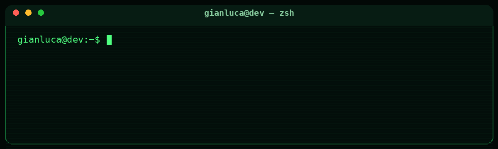
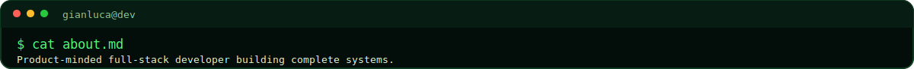
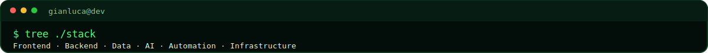
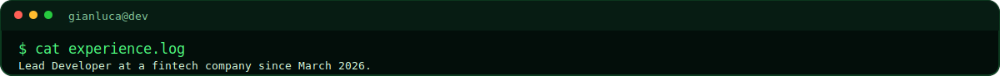
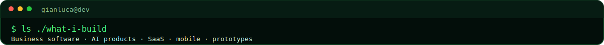
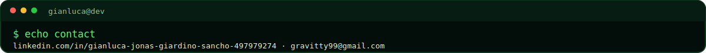

<a id="top"></a>

<div align="center">



<br><br>

<a href="#english">English</a> · <a href="#español">Español</a>

</div>

---

<a id="english"></a>



I’m a **Full-Stack Developer** from Argentina. I build complete digital products and usually work across the whole process: understanding the problem, shaping the product, designing the interface, writing the frontend and backend, connecting data and services, and taking everything to production.

Since **March 2026**, I’ve also been working as a **Lead Developer at a fintech company**, combining hands-on development with technical decisions, product thinking and coordination.

I’ve built business tools, inventory systems, ecommerce platforms, mobile apps, private chats, AI-powered products, RAG control panels, security-oriented applications and experimental prototypes. I care about clean interfaces, practical architecture and software that feels good to use.

<br>



### Frontend & mobile

<p>
  
</p>

`React` · `React Native` · `Next.js` · `Vite` · `JavaScript` · `TypeScript` · responsive UI · fluid animations

### Backend & APIs

<p>
  
</p>

`Node.js` · `Express` · `Python` · REST APIs · authentication · permissions · third-party integrations

### Databases & services

<p>
  
</p>

`MySQL` · `PostgreSQL` · `MongoDB` · `Firebase` · `Supabase` · SQL · NoSQL · realtime data

### Infrastructure & automation

<p>
  
</p>

`Docker` · `Linux` · VPS configuration · domains · DNS · deployments · native automation · `n8n`

### AI systems

<p>
  
  
  
</p>

LLM-powered products · conversational interfaces · RAG systems · AI dashboards · tool integrations · automated workflows

<br>



```text
2026 — Present   Lead Developer · Fintech
2023 — Present   Full-Stack development, freelance work and independent products
2023             Diploma in Web Development · Ícaro / Universidad Nacional de Córdoba
```

I keep learning by building real products, solving business problems, researching new tools and shipping software continuously.

<br>



<table>
<tr>
<td width="50%" valign="top">

**Business software**

- Stock and inventory systems
- Management dashboards
- Internal tools
- Ecommerce and catalogs
- Custom SaaS platforms

</td>
<td width="50%" valign="top">

**AI & automation**

- AI assistants
- Conversational products
- RAG dashboards
- Automated workflows
- API-driven tools

</td>
</tr>
<tr>
<td width="50%" valign="top">

**Web & mobile**

- Dynamic websites
- React Native applications
- Responsive interfaces
- Private chats
- Client-facing platforms

</td>
<td width="50%" valign="top">

**Product prototypes**

- MVPs
- Experimental interfaces
- Games
- Security-focused apps
- Custom product concepts

</td>
</tr>
</table>

```text
idea → product definition → UX/UI → architecture
     → frontend + backend → integrations → deployment → iteration
```

<div align="right"><a href="#top">↑ back to top</a></div>

---

<a id="español"></a>


Soy **desarrollador Full-Stack** de Argentina. Construyo productos digitales completos y suelo trabajar en todo el proceso: entender el problema, definir el producto, diseñar la interfaz, desarrollar frontend y backend, conectar datos y servicios, y llevar la solución a producción.

Desde **marzo de 2026** también trabajo como **Lead Developer en una fintech**, combinando desarrollo práctico con decisiones técnicas, visión de producto y coordinación.

He creado herramientas empresariales, sistemas de inventario, ecommerce, aplicaciones móviles, chats privados, productos con IA, paneles para controlar sistemas RAG, aplicaciones orientadas a seguridad y distintos prototipos experimentales. Me importan las interfaces limpias, la arquitectura práctica y que el software se sienta bien al usarlo.

<br>


### Frontend y mobile

<p>
  
</p>

`React` · `React Native` · `Next.js` · `Vite` · `JavaScript` · `TypeScript` · interfaces responsivas · animaciones fluidas

### Backend y APIs

<p>
  
</p>

`Node.js` · `Express` · `Python` · APIs REST · autenticación · permisos · integraciones externas

### Bases de datos y servicios

<p>
  
</p>

`MySQL` · `PostgreSQL` · `MongoDB` · `Firebase` · `Supabase` · SQL · NoSQL · datos en tiempo real

### Infraestructura y automatización

<p>
  
</p>

`Docker` · `Linux` · configuración de VPS · dominios · DNS · despliegues · automatización nativa · `n8n`

### Sistemas con IA

<p>
  
  
  
</p>

Productos con LLMs · interfaces conversacionales · sistemas RAG · dashboards con IA · integración de herramientas · flujos automatizados

<br>


```text
2026 — Actualidad   Lead Developer · Fintech
2023 — Actualidad   Desarrollo Full-Stack, trabajo freelance y productos propios
2023                Diplomatura en Desarrollo Web · Ícaro / UNC
```

Sigo ampliando mi experiencia construyendo productos reales, resolviendo problemas de negocio, investigando herramientas nuevas y desarrollando software de forma constante.

<br>


<table>
<tr>
<td width="50%" valign="top">

**Software empresarial**

- Sistemas de stock e inventario
- Dashboards de gestión
- Herramientas internas
- Ecommerce y catálogos
- Plataformas SaaS personalizadas

</td>
<td width="50%" valign="top">

**IA y automatización**

- Asistentes con IA
- Productos conversacionales
- Dashboards RAG
- Flujos automatizados
- Herramientas conectadas por APIs

</td>
</tr>
<tr>
<td width="50%" valign="top">

**Web y mobile**

- Sitios dinámicos
- Aplicaciones con React Native
- Interfaces responsivas
- Chats privados
- Plataformas para clientes

</td>
<td width="50%" valign="top">

**Prototipos de producto**

- MVPs
- Interfaces experimentales
- Juegos
- Aplicaciones orientadas a seguridad
- Conceptos digitales personalizados

</td>
</tr>
</table>

```text
idea → definición de producto → UX/UI → arquitectura
     → frontend + backend → integraciones → despliegue → iteración
```

<div align="right"><a href="#top">↑ volver arriba</a></div>

---

<div align="center">



<sub>Open to full-stack products, AI integrations and custom software.</sub>

</div>
